```mermaid
architecture-beta
    group ws(fabric:lakehouse)[Fabric Workspace]
    service lh(fabric:lakehouse)[Lakehouse] in ws
    service es(fabric:eventstream)[Eventstream] in ws
    lh:R --> L:es
```

```mermaid
architecture-beta
    group plan(fabric:notebook)[Analytics]
    service nb(fabric:notebook)[Notebooks] in plan
```

# Usage Examples

This guide covers using `mermaid-azure-icons` in various environments.

## 1. Plain HTML / CDN

No build step required. Icons load from jsDelivr CDN.

```html
<!doctype html>
<html>
<head>
    <meta charset="utf-8">
    <meta name="viewport" content="width=device-width, initial-scale=1">
    <script type="importmap">
    {
        "imports": {
            "mermaid": "https://cdn.jsdelivr.net/npm/mermaid@11/dist/mermaid.esm.min.mjs",
            "mermaid-azure-icons": "https://cdn.jsdelivr.net/npm/mermaid-azure-icons/dist/index.js"
        }
    }
    </script>
</head>
<body>
    <div class="mermaid">
        architecture-beta
            group src(fabric:eventstream)[Data Sources]
            service iot(fabric:eventstream)[IoT Events] in src
            group bronze(fabric:lakehouse)[Bronze Layer]
            service lh(fabric:lakehouse)[Lakehouse] in bronze
            iot:R --> L:lh
    </div>

    <script type="module">
        import mermaid from 'mermaid';
        import { registerAllIcons } from 'mermaid-azure-icons';

        registerAllIcons(mermaid);
        mermaid.contentLoaderAsync?.();
    </script>
</body>
</html>
```

## 2. Vite + React

Install from npm and register icons in your main app.

### Install

```bash
npm install mermaid mermaid-azure-icons
```

### main.tsx

```typescript
import React from 'react'
import ReactDOM from 'react-dom/client'
import mermaid from 'mermaid'
import { registerAllIcons } from 'mermaid-azure-icons'
import App from './App.tsx'

registerAllIcons(mermaid)

mermaid.initialize({ startOnLoad: true, securityLevel: 'loose' })

ReactDOM.createRoot(document.getElementById('root')!).render(
  <React.StrictMode>
    <App />
  </React.StrictMode>,
)
```

### Component usage

```typescript
export default function ArchitectureDiagram() {
  return (
    <div className="mermaid">
      {`
        architecture-beta
            group src(azure:analytics-144-event-hubs)[Event Sources]
            service eh(azure:analytics-144-event-hubs)[Event Hub] in src
            group bronze(azure:storage-86-storage-accounts)[Data Lake]
            service adls(azure:storage-86-storage-accounts)[ADLS Gen2] in bronze
            eh:R --> L:adls
      `}
    </div>
  )
}
```

## 3. Docusaurus

Register icons globally via clientModule entry point.

### docusaurus.config.js

```javascript
module.exports = {
  title: 'My Docs',
  plugins: [],
  clientModules: [
    require.resolve('./src/clientModules/registerIcons.ts'),
  ],
}
```

### src/clientModules/registerIcons.ts

```typescript
import mermaid from 'mermaid'
import { registerAllIcons } from 'mermaid-azure-icons'

export function onRouteDidUpdate() {
  registerAllIcons(mermaid)
}
```

### Write diagrams in markdown

````markdown

````

## 4. Hugo

Add icon registration to your Hugo theme layout.

### layouts/partials/head-end.html

```html
<script type="importmap">
{
    "imports": {
        "mermaid": "https://cdn.jsdelivr.net/npm/mermaid@11/dist/mermaid.esm.min.mjs",
        "mermaid-azure-icons": "https://cdn.jsdelivr.net/npm/mermaid-azure-icons/dist/index.js"
    }
}
</script>

<script type="module">
    import mermaid from 'mermaid'
    import { registerAllIcons } from 'mermaid-azure-icons'

    registerAllIcons(mermaid)
    mermaid.contentLoaderAsync?.()
</script>
```

### Write diagrams in Markdown

````markdown

````

## 5. VS Code Mermaid Preview Extension

Custom Mermaid config via `mermaid.preview.config` setting.

### .vscode/settings.json

```json
{
    "mermaid.preview.config": {
        "startOnLoad": false,
        "securityLevel": "loose"
    }
}
```

### For custom icons: Full page preview

Since the VS Code Mermaid Preview extension doesn't execute custom JavaScript to register icon packs, use the dedicated `test/smoke.html` pattern from the mermaid-azure-icons repository:

```html
<!-- test/diagram-preview.html -->
<script type="module">
    import mermaid from 'https://cdn.jsdelivr.net/npm/mermaid@11/dist/mermaid.esm.min.mjs'
    import { registerAllIcons } from 'https://cdn.jsdelivr.net/npm/mermaid-azure-icons/dist/index.js'

    const diagramText = `
        architecture-beta
            service adf(fabric:data-factory)[Data Factory]
            service lh(fabric:lakehouse)[Lakehouse]
            adf:R --> L:lh
    `

    registerAllIcons(mermaid)
    mermaid.initialize({ startOnLoad: false, securityLevel: 'loose' })
    
    const { svg } = await mermaid.render('diagram', diagramText)
    document.body.innerHTML = svg
</script>
```

Open this HTML file in a browser to preview with custom icons.

## 6. Claude/GitHub Copilot Chat

### Option A: Include dist files as context

1. Upload `dist/fabric.json` and `dist/azure.json` as file context to your chat
2. Reference them in your prompt: "using the icons in fabric.json and azure.json..."
3. Copilot will see the full slug list in the icon definitions

### Option B: Reference copilot-instructions.md

Copilot reads `.github/copilot-instructions.md` automatically in your workspace. This file includes:

- Complete slug tables for all 1,444 Fabric icons
- Complete slug tables for all 465 Azure icons
- Icon naming conventions and Mermaid syntax

The instructions are auto-loaded when Copilot reads your repo, so prompt with:

```
Generate a Mermaid architecture-beta diagram using icons from .github/copilot-instructions.md
```

Copilot will have full access to all available icon slugs without explicit uploads.

## 7. GitHub Copilot / VS Code Agent

### Automatic context

When you open a workspace with `mermaid-azure-icons`:

1. VS Code Copilot automatically loads `.github/copilot-instructions.md`
2. The file contains all icon slugs and usage rules
3. Copilot uses this context for diagram generation

### Explicit reference

To force context reload in a chat:

```
#file:.github/copilot-instructions.md

Generate a medallion architecture diagram using these icons.
```

### In Agent/Quick Chat

For diagram generation in @workspace context:

```
Generate Mermaid architecture-beta diagram using:
- fabric:eventstream, fabric:lakehouse, fabric:report
- azure:storage-86-storage-accounts, azure:databases-138-azure-synapse
```

Copilot will reference the instruction file automatically and validate slugs against the available icon packs.

---

## Testing Your Integration

After registering icons, verify they loaded correctly:

```javascript
// Option 1: Check in browser console
fetch('https://cdn.jsdelivr.net/npm/mermaid-azure-icons@latest/dist/fabric.json')
  .then(r => r.json())
  .then(pack => console.log(`Loaded ${Object.keys(pack.icons).length} Fabric icons`))

// Option 2: In your app, after rendering
const missingIcons = document.querySelectorAll('text:contains("?")').length
console.log(missingIcons === 0 ? '✅ All icons loaded' : '❌ Missing icons detected')
```

See `test/smoke.html` in the repository for a full working example.
